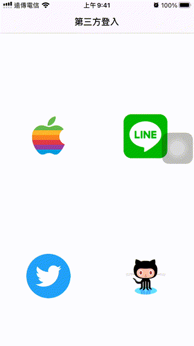

# :no_entry: [DEPRECATED - 已不再維護](https://github.com/William-Weng/WWSignInWith3rd)

# WWSignInWith3rd
[](https://developer.apple.com/swift/) [](https://developer.apple.com/swift/) [](https://developer.apple.com/swift/) [](https://developer.apple.com/swift/)

Third-party login integration, as for the parameter values in the program, and the related setting values of info.plist, please refer to each developer platform.

The author’s search-related record pages are all recorded in the code. If you are interested, you can refer to it.

The main reason for the production is that although Google’s third-party login integration is very complete, the most important thing is to obtain its ID, and other functions are unnecessary. I also learn the basic OAuth 2.0 authentication implementation by the way...

第三方登入整合，至於程式中的參數值，與info.plist的相關設定值，詳見各開發者平臺…

作者的搜尋相關記錄網頁，都記在程式碼之中，有興趣可以參考參考…

製作的原因，主要是雖然[Google的第三方登入](https://medium.com/彼得潘的-swift-ios-app-開發問題解答集/利用-firebase-實現-ios-app-的登入功能-cf1795ccec00)整合的很完整，但是最主要是的取得它的ID，而其它的功能就沒什麼必要了，也順道學學基本的[OAuth 2.0](https://medium.com/麥克的半路出家筆記/筆記-認識-oauth-2-0-一次了解各角色-各類型流程的差異-c42da83a6015)的認證實作…



### 目前支援
1. [Apple 第三方登入 -> 原生](https://developer.apple.com)
1. [GitHub 第三方登入 -> WEB](https://developer.github.com)
1. [Line 第三方登入 -> APP / WEB](https://developers.line.biz)
1. [Twitter 第三方登入 -> WEB](https://developer.twitter.com)

### [Installation with Swift Package Manager](https://medium.com/彼得潘的-swift-ios-app-開發問題解答集/使用-spm-安裝第三方套件-xcode-11-新功能-2c4ffcf85b4b)
```
dependencies: [
    .package(url: "https://github.com/William-Weng/WWSignInWith3rd.git", .upToNextMajor(from: "1.0.0"))
]
```

### Example
```swift
import UIKit
import WWSignInWith3rd

@main
final class AppDelegate: UIResponder, UIApplicationDelegate {

    var window: UIWindow?
    
    func application(_ application: UIApplication, didFinishLaunchingWithOptions launchOptions: [UIApplication.LaunchOptionsKey: Any]?) -> Bool {
        
        WWSignInWith3rd.Line.shared.configure(channelId: "<channelId>", channelSecret: "<channelSecret>", universalLinkURL: "<universalLinkURL>")
        WWSignInWith3rd.GitHub.shared.configure(clientId: "<clientId>", secret: "<secret>", callbackURL: "<callbackURL>", scope: "<scope>")
        WWSignInWith3rd.Twitter.shared.configure(apiKey: "<apiKey>", secret: "<secret>", accessToken: "<accessToken>", accessTokenSecret: "<accessTokenSecret>")

        return true
    }
}

// MARK: - 相關設定
extension AppDelegate {
    
    func application(_ app: UIApplication, open url: URL, options: [UIApplication.OpenURLOptionsKey: Any] = [:]) -> Bool {

        _ = WWSignInWith3rd.Twitter.shared.canOpenURL(app, open: url, options: options)
        _ = WWSignInWith3rd.Line.shared.canOpenURL(app, open: url, options: options)

        return true
    }
    
    func application(_ application: UIApplication, continue userActivity: NSUserActivity, restorationHandler: @escaping ([UIUserActivityRestoring]?) -> Void) -> Bool {
                
        _ = WWSignInWith3rd.Line.shared.canOpenUniversalLink(application, continue: userActivity, restorationHandler: restorationHandler)

        return true
    }
}
```
```swift
import UIKit
import WWSignInWith3rd

final class ViewController: UIViewController {

    @IBOutlet weak var resultTextView: UITextView!
    
    override func viewDidLoad() {
        super.viewDidLoad()
    }
    
    /// [Apple 第三方登入](https://developer.apple.com)
    @IBAction func signInWithApple(_ sender: UIButton) {
        
        WWSignInWith3rd.Apple.shared.login { result in
            
            switch result {
            case .failure(let error): self.displayResultText(text: error)
            case .success(let info): self.displayResultText(text: info.credential?.email)
            }
        }
    }
    
    /// [Line 第三方登入](https://developers.line.biz)
    @IBAction func signInWithLine(_ sender: UIButton) {
        
        WWSignInWith3rd.Line.shared.login(presenting: self) { result in
            
            switch result {
            case .failure(let error): self.displayResultText(text: error)
            case .success(let profile): self.displayResultText(text: profile?.displayName)
            }
        }
    }

    /// [Twitter 第三方登入](https://developer.twitter.com)
    @IBAction func signInWithTwitter(_ sender: UIButton) {
        
        WWSignInWith3rd.Twitter.shared.login(presenting: self) { result in
            
            switch result {
            case .failure(let error): self.displayResultText(text: error)
            case .success(let token): self.displayResultText(text: token)
            }
        }
    }

    /// [GitHub 第三方登入](https://developer.github.com)
    @IBAction func signInWithGithub(_ sender: UIButton) {
                
        WWSignInWith3rd.GitHub.shared.loginWithWeb(presenting: self) { result in
            
            switch result {
            case .failure(let error): self.displayResultText(text: error)
            case .success(let data): self.displayResultText(text: data)
            }
        }
    }
}

// MARK: - ViewController (private class function)
extension ViewController {
    
    private func displayResultText(text: Any?) {
        
        DispatchQueue.main.async {
            self.resultTextView.text = "\(String(describing: text))"
        }
    }
}
```
